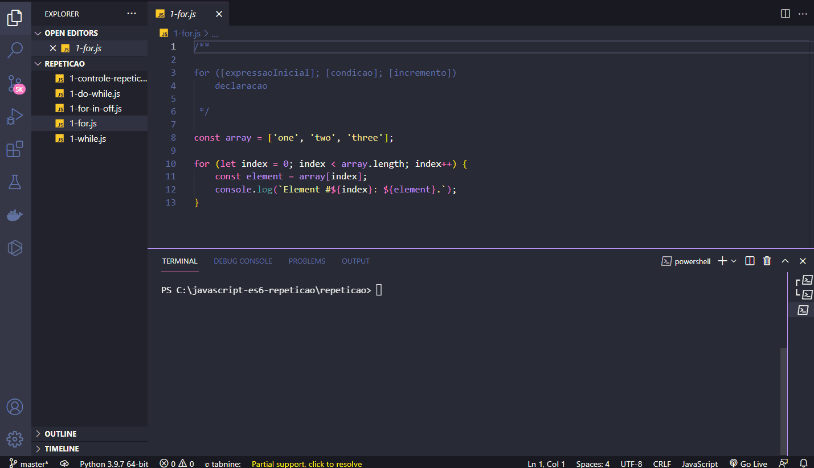

<h1 align="center">
  
   
  JavaScript ES6 - Repeating Structure
</h1>

<h3 align="justify">
Didactic demonstration of the main JavaScripty ES6 repeating structure. Credits for the Digital Innovation One Essential ES6 JavaScript module.
</h3>

 

## 📷 Demonstration

<h4 align="left"> Control repetition </h4>
  
   
<h4 align="left" > Do while </h4>  
  
   
<h4 align="left"> For in off </h4>
  
   
<h4 align="left"> For </h4>
  
   
<h4 align="left"> While </h4>
  
   

 

## 🚀 Technologies

This project was developed with the following technologies:

- JavaScript ES6
- NodeJs

 

## ⚙ Structures
- control repetition
- do while
- for in off
- for
- while

 

---

Made with 💜 by Rafael Maciel
